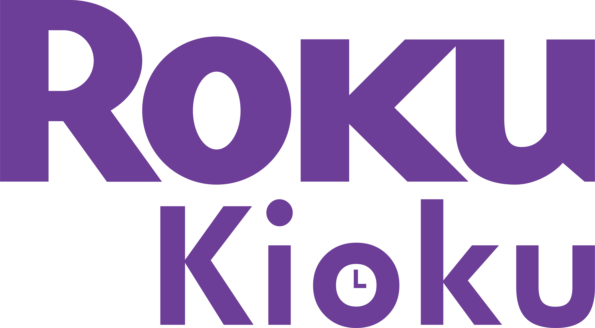

# Roku Kioku

Hi there, and welcome to Roku Kioku. Roku Kioku is a streaming service based off of the Roku brand. Roku Kioku allows our users to watch movies, tv shows, and more from your phone, tv, or computer directly from the internet, no downloads needed! Our goal is to provide our users with a easy to use, functioning way to watch their favourite media from the convenience of their own couch.

So what are you waiting for? Hop in and enjoy Roku Kioku

## Plan

Dev Notes
https://docs.google.com/document/d/1bTbDZgFouTz_285Ouc-8wm4xBHy-pT69/edit?usp=sharing&ouid=114925206480625209140&rtpof=true&sd=true

Design Notes
https://docs.google.com/document/d/1grr_1oJSdH_d3z_MBP6iRiQoMs4J84kW/edit?usp=sharing&ouid=114925206480625209140&rtpof=true&sd=true

Our plan for the moment splits into 2 seperate parts, design and development. 

For design, we plan to start with a account screen, and then load into your account along with many movies and tv shows you might like. Then, all you would have to do is select what you want to watch and relax.

For development, we plan to start mobile first and work up to desktop size so our service can be used on any device. We plan to use API's and database assets that will be compiled on the page using Vue (this will be the movies, titles, ratings, etc). We will have a filter feature to filter out certain media depending on what you would like to watch, this will all be done with linking tables and sql. For certain accounts (children accounts) we will have to filter out anything not appropriate for kids.

## Team

Roku Kioku was designed and built by Evan Hansen & Matthew Tenuta 

## Installation

No Installation Required

## License

MIT

